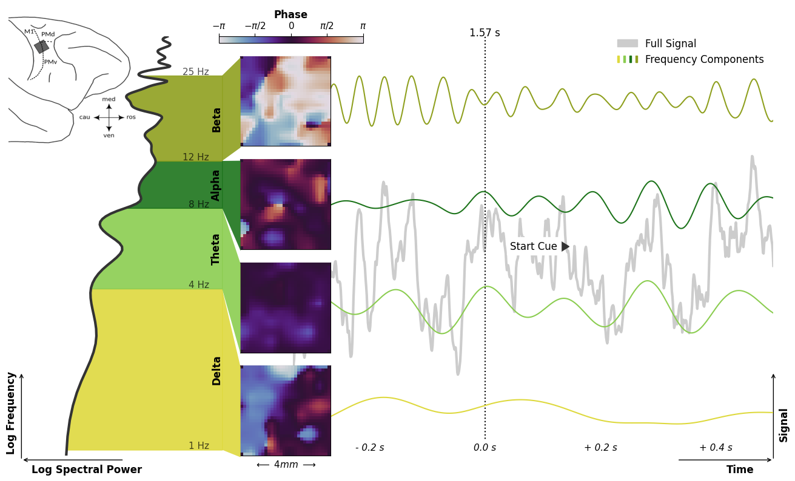

# Brain Waves in the Motor Cortex

[-> Video](https://rgutzen.github.io/assets/visualizing_waves/brain_wave_visualization.mp4)

## Abstract
Much of the communication between neurons in the brain happens via electric pulses (Action Potentials). However, there are also continuous electric potentials all around the neurons, and especially their low frequency components appear to be relevant for various aspects of brain function.
Different frequencies correlate to different types of brain states and activity and are thus organized into regimes. For example, oscillations in the Beta range (\~12-25 Hz) can be associated with movement planing; the Alpha range (\~8-12 Hz) is thought to relate to memory formation and consolidation; the Theta range (\~4-8 Hz) is often studied in relation to attention; and the Delta range (\~1-4 Hz) is assumed to be related to decision making.

Yet, the phenomenon of oscillatory and wave-like neural signals is immensely complex and the underlying mechanisms remain unclear.
Even on a purely descriptive level, the rich dynamics of neural oscillations are challenging to capture in a coherent picture. There are complex interactions between spatially separated signal sources as well as between their frequency components. Such interactions, for example, give rise to a variety of propagating wave patterns that are observable in the amplitude and the phase of the neural activity.

Here, an open-access dataset of neural activity is analyzed that was recorded by a square electrode array in the motor cortex (as indicated in the inset image) of a macaque monkey during a hand movement task [1]. In this task the monkey is instructed to reach for an object and to grasp it after receiving two visual cues specifying the grip type (precision grip or side grip) and the grip force (high force or low force).
The visualization brings together the diverse aspects of the oscillatory neural activity and illustrates their interactions. It shows four different frequency regimes, their spectral power in the frequency domain, their wave-like activity across electrode array, and the signal evolution in time.

The visualization of the activity phase in space reveals spiral, circular, planar, and synchronous wave patterns. Here, it becomes apparent how distinct features of the neural activity are appearing in parallel in the different frequency regimes, not unlike separate communication channels. The power spectrum on the left hand side shows their varying contributions to the full signal. Yet, the signal time course on the right hand side shows how the signal components also align to each other, especially around behaviorally relevant events.

As reaction to the 'Grip-Type Cue', the Beta and Alpha components increase in spectral power and show a more synchronized activity across the electrode array.
During the actual movement, however, they are reduced in favor of Theta and Delta contributions. Whereas, there seem to be a general correlation between the spectral power and the kind of expressed wave patterns.
Such visualized relations between the aspects of the neural signals and their correlations to behavioral events may serve as a basis to guide further investigations of the functional role of brain waves.

[1] Brochier, T. et al. (2018) "Massively parallel recordings in macaque motor cortex during an instructed delayed reach-to-grasp task". Sci Data 5, 180055, https://doi.org/10.1038/sdata.2018.55

## Replication Guide
_for Linux systems_
#### 1) create and activate Python environment
```
conda env create -f environment.yaml
conda activate visualizing_cortical_waves
pip install git+https://github.com/NeuralEnsemble/python-neo.git
```
and make sure that __ffmpeg__ is installed to create the video,
as well as the __git__, and the __git-annex__ client to automatically clone the data.
Alternatively, it can be downloaded manually from the repository page (see below).
#### 2) run the snakemake workflow
```
snakemake --cores=1
```
#### 3) profit
The video file and the frame images are stored in _output/_

## Resources
#### Data
* Data Publication: [Brochier, T., Zehl, L., Hao, Y. et al. Massively parallel recordings in macaque motor cortex during an instructed delayed reach-to-grasp task. Sci Data 5, 180055 (2018)](https://doi.org/10.1038/sdata.2018.55)
* Data Repository: [gin.g-node.org/INT/multielectrode_grasp](https://gin.g-node.org/INT/multielectrode_grasp)

#### Tools
* Workflow management: [Snakemake](https://snakemake.readthedocs.io/en/stable/)
* Analysis package: [Elephant](https://elephant.readthedocs.io/en/latest/)
* Data Format: [Neo](https://neo.readthedocs.io/en/stable/)
* Metadata Format: [odML](https://g-node.github.io/python-odml/)
